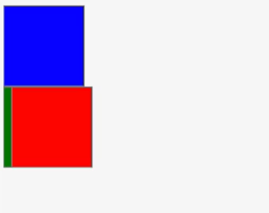

# CSS Layout
> Box model, margin, border, padding, position, float의 개념을 이해한다.

## 엘리먼트가 배치되는 방식
* 엘리먼트를 화면에 배치하는 것을 layout 작업, Rendering 과정이라고 부른다.
* 엘리먼트는 위에서 아래로 순서대로 블럭을 이루며 배치되는 것이 기본이지만, 웹사이트의 배치는 다양하게 표현 가능해야 하기 때문에 css가 추가적인 속성을 제공한다.
    * **display(block, inline, inline-block)**
    * **position(static, absolute, relative, fixed)**
    * **float(left, right)**

### display
#### block
엘리먼트를 아래로 쌓이게 한다. 혼자 한 줄을 차지하게 된다.
* `<div>`, `<p>`, `<h1>`...

#### inline
엘리먼트를 오른쪽으로 흐르게 한다. **줄바꿈 없이 한 줄에 다른 엘리먼트들과 나란히 배치**된다. 탭이나 네비게이션과 같은 메뉴를 inline 속성을 통해 배치하는 경우도 있다.
* `<span>`, `<a>`, `<strong>`, `<em>`...

⚠️ 해당 태크가 마크업하고 있는 컨텐츠의 크기 만큼만 공간을 차지하도록 되어 있기 때문에 `width`와 `height` 속성을 지정해도 무시되고, `margin`과 `padding` 속성은 좌우 간격만 반영되고 상하 간격은 반영되지 않는다.

#### inline-block
기본적으로 `inline` 처럼 다른 엘리먼트들과 나란히 배치되지만, `block` 엘리먼트처럼 `width`, `height`, `margin`, `padding` 속성의 상하 간격 지정이 가능하다.

여러 개의 엘리먼트를 한 줄에 원하는 너비만큼 배치하고 싶을 때 사용할 수 있다.
* `<button>`, `<input>`, `<select>`

### position
> 상대적/절대적으로 어떤 위치에 엘리먼트를 배치할지 결정

#### static
position의 기본 값. 순서대로 배치됨을 의미한다.

#### absolute
기준점에 따라서 특별한 위치에 위치시킨다.

`top`, `left`, `right`, `bottom`으로 설정한다. 기준점을 상위 엘리먼트로 단계적으로 찾아가는데 **`static`이 아닌 `position`이 기준점**이 된다.

#### relative
원래 자신이 위치해야 할 곳을 기준으로 상대적인 값을 부여할 수 있다.

`top`, `left`, `right`, `bottom`으로 설정한다. 값을 부여하지 않으면 static과 동일하게 작동한다.

#### fixed
viewport(전체화면) 좌측, 맨위를 기준으로 동작한다.

### margin
> 상하좌우 엘리먼트와 본인간의 간격

### float
> 원래의 flow에서 벗어나 둥둥 떠다닐 수 있다. 뒤에 block 엘리먼트가 float된 엘리먼트를 의식하지 못하고 중첩되서 배치된다.

```html
<div class="blue"></div>
<div class="green"></div>
<div class="red"></div>
```

```css
div {
    width: 100px;
    height: 100px;
    border: 1px solid gray;
    font-size: 0.7em;
}

.blue {
    background-color: blue;
}

.green {
    float: left;
    background-color: green;
}

.red {
    background-color: red;
    position: relative;
    left: 10px;
}
```



green을 `float`하면, green은 위로 떠있고 red가 빈자리를 차지 -> 위로 올라온다. 따라서 blue, red가 쌓이고 green은 `float`로 둥둥 떠있는 상태

### box-model
> 블록 엘리먼트의 경우 box의 크기와 간격에 관한 속성으로 배치를 추가 결정한다. `margin`, `padding`, `border`, `outline`으로 생성된다.

#### 엘리먼트의 크기
`block` 엘리먼트의 크기는 기본적으로 부모의 크기만큼을 가진다.

#### box-sizing
`padding` 속성을 늘리면 엘리먼트의 크기가 달라질 수 있다. `box-sizing` 속성으로 이를 컨트롤 할 수 있고, `box-sizing` 속성을 `border-box`로 설정하면 엘리먼트의 크기를 고정하면서 `padding` 값만 늘릴 수 있다.
* `box-sizing: content-box` : `box-sizing`의 기본 값. 이 영역이 `padding`에 의해서 계속 커질 수 있다.
* `box-sizing: border-box` : 박스의 크기를 테두리라고 지정해줘서 전체 크기를 유지하려고 한다.

## 정리
* 전체 레이아웃은 `float`를 잘 사용해서 2단, 3단 컬럼 배치를 구현한다.
  * 최근에는 `css-grid`나 `flex` 속성등 layout을 위한 속성을 사용하기 시작했으며 브라우저 지원범위를 확인해서 사용한다.
* 특별한 위치에 배치하기 위해서는 `positon: absolute`를 사용하고, 기준점을 `relative`로 설정한다.
* 네비게이션과 같은 엘리먼트는 `block` 엘리먼트를 `inline-block`으로 변경해서 가로로 배치하기도 한다.
* 엘리먼트 안의 텍스트의 간격과, 다른 엘리먼트간의 간격은 `padding`과 `margin` 속성을 잘 활용해서 위치시킨다.