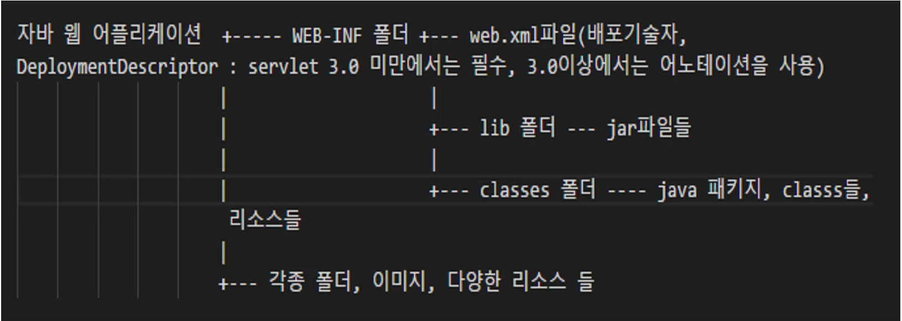
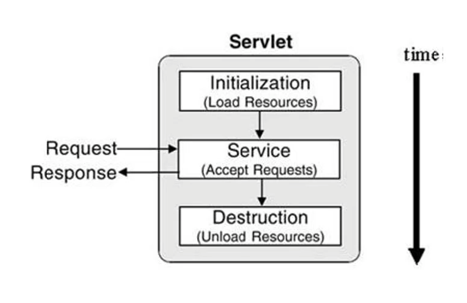

# Servlet
> 웹 애플리케이션은 정적인 콘텐츠와 동적인 콘텐츠로 나누어 볼 수 있다. 프로그램을 수행해서 **페이지를 동적으로 만들어 주는** 서블릿에 대해 알아보자.

## Java Web Application
* WAS에 설치(deploy)되어 동작하는 어플리케이션
* 자바 웹 어플리케이션에는 HTML, CSS, 이미지, 자바로 작성된 클래스(Servlet, package, interface 등), 각종 설정 파일 등이 포함된다.
### 자바 웹 어플리케이션의 폴더 구조

* middleware, framework 등을 사용하기 위해서는 반드시 정해진 폴더 구조를 지켜야 한다.
* **WEB-INF**
  * `web.xml` : 배포 기술자, 웹 애플리케이션에 대한 정보들을 다 가지고 있다. servlet 3.0 미만에서는 필수, 이후에는 어노테이션을 사용
  * `lib` : jar 파일들
  * `classes` : java 패키지, class들
  * `리소스들` : HTML, CSS, javascript, img 등 ...

## Servlet이란?
* 자바 웹 어플리케이션의 구성요소 중 동적인 처리를 하는 프로그램의 역할
1. 서블릿(servlet)은 WAS에서 동작하는 Java 클래스이다.
2. 서블릿은 HttpServlet 클래스를 상속받아야 한다.
3. 서블릿과 JSP로부터 최상의 결과를 얻으려면, 웹 페이지를 개발할 때 이 두가지를 조화롭게 사용해야 한다.
ex) 웹 페이지를 구성하는 화면(HTML)은 JSP로 표현하고, 복잡한 프로그래밍은 서블릿으로 구현

## Servlet 작성 방법
1. Servlet 3.0 spec 이상에서 사용하는 방법
* web.xml 파일을 사용하지 않음
* 자바 어노테이션(annotation)을 사용
```java
@WebServlet("/ten")
public class TenServlet extends HttpServlet { ... }
```

2. Servlet 3.0 spec 미만에서 사용하는 방법
* Servlet을 등록할 때 web.xml파일에 등록
```xml
<servlet>
    <description></description>
    <display-name>TenServlet</display-name>
    <servlet-name>TenServlet</servlet-name>
    <servlet-class>exam.TenServlet</servlet-class>
</servlet>
<servlet-mapping>
    <servlet-name>TenServlet</servlet-name>
    <url-pattern>/ten</url-pattern>
</servlet-mapping>
```

### Servlet 3.0 spec 이상에서 사용하는 방법
> http://localhost:8080/exam31/ten 으로 동작하도록 설정하고, 1부터 10까지 출력하기

```java
@WebServlet("/ten")
public class TenServlet extends HttpServlet {
	private static final long serialVersionUID = 1L;
       
    /**
     * @see HttpServlet#HttpServlet()
     */
    public TenServlet() {
        super();
        // TODO Auto-generated constructor stub
    }

	/**
	 * @see HttpServlet#doGet(HttpServletRequest request, HttpServletResponse response)
	 */
	protected void doGet(HttpServletRequest request, HttpServletResponse response) throws ServletException, IOException {
		response.setContentType("text/html;charset=utf-8");
		PrintWriter out = response.getWriter();
		out.print("<h1>1~10까지 출력</h1>");
		for (int i = 1; i <= 10; i++) {
			out.print(i + "<br>");
		}
		out.close();
	}

}
```
* `@WebServlet("/ten")` 어노테이션을 통해 Servlet을 등록해주고 있다.
* 어노테이션에 작성한 URL Mapping에 따라 요청하는 주솟값이 달라진다.


#### 💡 HttpServletRequest와 HttpServletResponse
* 클라이언트가 요청할 때 서버는 **요청을 받아내는 객체**와 **응답을 하기 위한 객체**를 자동으로 만들어 낸다.
* 요청에 대한 정보는 `HttpServeltRequest`안에 추상화시켜 가지고 있고, 응답에 대한 부분은 `HttpServletResponse` 안에 가지고 있다.
* 따라서, 응답으로 뭔가 돌려주고 싶을 때에는 `HttpServletResponse` 객체에 넣어 돌려준다.
  
### Servlet 3.0 spec 미만에서 사용하는 방법
> http://localhost:8080/exam25/ten으로 동작하도록 설정하고, 1부터 10까지 출력하기

```xml
<servlet>
    <description></description>
    <display-name>TenServlet</display-name>
    <servlet-name>TenServlet</servlet-name>
    <servlet-class>exam.TenServlet</servlet-class>
  </servlet>
  <servlet-mapping>
    <servlet-name>TenServlet</servlet-name>
    <url-pattern>/ten</url-pattern>
  </servlet-mapping>
```
* Servlet을 생성하면 `web.xml` 파일에 `<servlet>, <servlet-mapping>` 태그가 만들어진다.
* 서블릿은 요청이 들어왔을 때 반드시 서블릿 이름으로 요청하지는 않기 때문에 `web.xml`은 '클라이언트가 요청할 때 이런 `<url-pattern>`으로 요청하면 `<servlet-name>`이 같은 Servlet을 찾아서 실제 `<servlet-class>` 안에 있는 `<servlet-name>` 클래스를 실행시켜 주세요' 라는 의미를 갖는다.
* 만약 url-pattern 안에 요청된 url이 존재하지 않는다면 404 페이지를 반환한다.
* `web.xml`이 바뀌면 서버는 반드시 restart 되어야 한다.

## Servlet Life Cycle
> 서블릿의 생명주기 이해

```java
@WebServlet("/LifecycleServlet")
public class LifecycleServlet extends HttpServlet {
	private static final long serialVersionUID = 1L;
       
    public LifecycleServlet() {
    	System.out.println("LifecycleServlet 생성");
    }

	public void init(ServletConfig config) throws ServletException {
		System.out.println("init 호출");
	}


	public void destroy() {
		System.out.println("destroy 호출");
	}

	protected void service(HttpServletRequest request, HttpServletResponse response) throws ServletException, IOException {
		System.out.println("service 호출");
	}

}
```

```
실행 결과
LifecycleService 생성
init 호출
service 호출

// 새로고침 한 경우
serivce 호출

// 코드가 수정된 경우
destroy 호출
// 새로고침
LifecycleService 생성
init 호출
service 호출 
```

1. 해당 URL로 클라이언트가 서버에게 요청하면, 서버는 /LifecycleServlet URL 매핑이 LifecycleServlet 클래스라는 정보를 알아낸다.
2. 해당 클래스가 메모리에 존재하는지 검사한다.
   1. 존재한다면 해당 객체를 사용한다.
   2. 존재하지 않는다면 객체를 생성한 후 사용한다.
3. 서블릿이 수정되면 메모리에 존재하던 서블릿 객체는 더이상 사용될 수 없으므로 메모리에서 destory된다.
4. 새로고침하면, 해당하는 객체가 메모리에 존재하지 않으므로 다시 생성 후 사용한다.

* 요청이 들어왔을 때 응답해야 하는 모든 내용은 `service()`라는 메서드에 구현해야 한다.
* WAS가 종료되거나 웹 애플리케이션이 새롭게 갱신될 경우에만 `destroy()` 메서드가 실행된다.

### service(request, response) 메소드

#### ❓`service()` 메서드를 호출하는 예만 수행하는데 `doGet()`은 어떻게 실행됐을까?
* HttpServlet의 service 메소드는 템플릿 메소드 패턴으로 구현
  * 클라이언트의 요청이 GET일 경우에는 자신이 가지고 있는 `doGet(request, response)` 메소드를 호출
  * 클라이언트의 요청이 Post일 경우에는 자신이 가지고 있는 doPost(request, response)를 호출
* 따라서, HelloServlet에서 `service()` 메서드를 오버라이드 하지 않고 `doGet()` 메서드만 오버라이드 했지만 알아서 `doGet()` 메서드가 호출되면서 그 안에 구현해두었던 HelloServlet을 응답 결과로 보내줌

## Request, Response 객체 이해하기
> 클라이언트가 서버에게 보낸 요청을 추상화한 객체 `HttpServletRequest`와 서버가 클라이언트에게 응답하기 위한 정보를 추상화한 객체 `HttpServletResponse`에 대해 알아본다.

* 클라이언트가 서버에게 요청을 보내면 서버는 `HttpServletRequest`, `HttpServletResponse` 두 객체를 생성
* 요청 정보에 있는 path로 매핑된 서블릿에게 전달
* 전달된 객체는 `service(), doGet(), doPost()`같은 메서드에 파라미터로 전달돼서 사용됨
* `HttpServletRequest`는 HTTP 프로토콜의 request 정보를 서블릿에게 전달
  * 헤더 정보, 파라미터 정보, URL, URI, 사용 언어 등
* `HttpServletResponse`는 content type, 응답 코드, 응답 메세지 등을 전송

### Request 헤더 정보 살펴보기
```java
protected void doGet(HttpServletRequest request, HttpServletResponse response) throws ServletException, IOException {
		response.setContentType("text/html");
		PrintWriter out = response.getWriter();
		out.println("<html>");
		out.println("<head><title>form</title></head>");
		out.println("<body>");
		
		Enumeration<String> headerNames = request.getHeaderNames();
		while(headerNames.hasMoreElements()) {
			String headerName = headerNames.nextElement();
			String headerValue = request.getHeader(headerName);
			out.println(headerName + " : " + headerValue + "<br>");
		}
		
		out.println("</body>");
		out.println("</html>");
	}
```

* `request.getHeaderNames()` : 모든 헤더 이름을 문자열 Enumeration 객체로 반환
* `request.getHeader(headerName)` : headerName에 해당하는 헤더 값을 반환

```
출력 결과
host : localhost:8080
connection : keep-alive
sec-ch-ua : "Not/A)Brand";v="99", "Google Chrome";v="115", "Chromium";v="115"
sec-ch-ua-mobile : ?0
sec-ch-ua-platform : "Windows"
...
```

### 파라미터 읽어 들이기
> URL 주소의 파라미터 정보를 읽어들여 브라우저 화면에 출력한다.

http://localhost:8080/firstweb/param?name=kim&age=5

* 위 URL에서 ?를 기준으로 뒤에 있는 부분을 파라미터라고 한다.
* &를 사용해 더 많은 파라미터를 전달할 수 있고, =을 기준으로 앞에 있는 것은 파라미터 이름, 뒤에 있는 것은 파라미터 값이다.
* `request.getParamater(parameterName)` 메서드를 수행해 parameter value를 가져올 수 있다.
* 이런 파라미터들은 반드시 URL을 통해서 넘어오는 것이 아니라 input 태그 안에 들어있는 값을 넘겨서 똑같이 사용할 수 있다.

### 그 외의 요청정보 출력
> URI, URL, PATH, Remote host 등에 대한 정보를 출력한다.

`request.getRequestURI()` : 도메인과 포트 이하에 있는 값을 return
`request.getRequestURL()` : 요청한 주소 전체 return
`request.getContentPath()` : 웹 애플리케이션과 매핑된 path return
`request.getRemoteAddr()` : 클라이언트의 주소 return