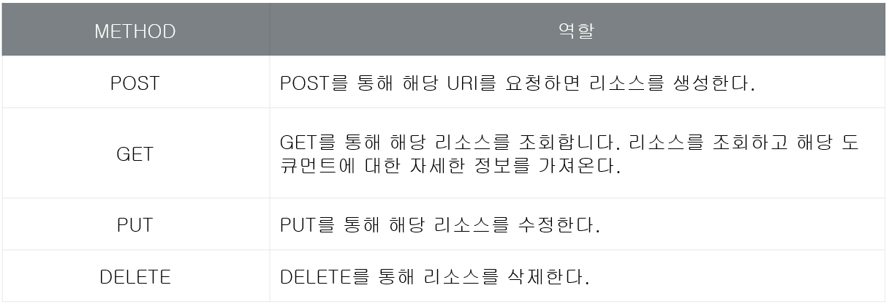

# REST API와 Web API
> REST API와 Web API가 각각 무엇인지 이해하고 구분할 수 있다.

## API란?
💡 API는 Application Programming Interface의 약자로, 응용 프로그램에서 사용할 수 있도록 운영 체제나 프로그래밍 언어가 제공하는 기능을 제어할 수 있게 만든 인터페이스를 의미한다.

ex) [Java 8 API 문서](https://docs.oracle.com/javase/8/docs/api/)

위와 같이 구현 코드를 알지 못해도 인터페이스만 알면 사용할 수 있도록 만든 것!

## REST API란?
💡REpresentational State Transfer의 약자로, 말 그대로 REST 형식의 API를 말한다. 즉, 핵심 컨텐츠 및 기능을 외부 사이트에서 활용할 수 있도록 제공되는 인터페이스이다.

ex) [네이버 API](https://developers.naver.com/products/intro/plan/plan.md), [페이스북의 그래프 API](https://developers.facebook.com/docs/graph-api), [공공 데이터 포털](https://www.data.go.kr/)

### REST 구성
* **자원(Resource)** - URI
* **행위(Verb)** - HTTP METHOD
* **표현(Representations)**

### REST 특징
1. Uniform interface
* 리소스가 URI로 식별되어야 한다.
* 리소스를 생성, 수정, 추가하고자 할 때 HTTP 메시지에 표현을 해서 전송해야 한다.
* 메시지는 스스로 설명할 수 있어야 한다.
* 애플리케이션의 상태는 Hyperlink를 통해 전이되어야 한다. (HATEOAS)

⚠️ 메시지가 스스로 설명할 수 있어야 하는 부분과 HATEOAS를 지원하는 것은 웹과는 다르게 API로 쉽지 않기 때문에 보통 Web API를 사용한다.

2. Stateless
* 작업을 위한 상태정보를 따로 저장하고 관리하지 않는다.
* API 서버는 들어오는 요청만을 단순히 처리한다.
3. Cacheable
* HTTP가 가진 캐싱 기능을 적용할 수 있다.
4. Self-descriptiveness
* REST API 메시지만 보고도 이를 쉽게 이해할 수 있는 자체 표현 구조로 되어 있다.
5. Client-server
* REST 서버는 API 제공, 클라이언트는 사용자 인증이나 컨텍스트(세션, 로그인 정보) 등을 직접 관리하는 구조를 갖는다.
* 각각의 역할이 확실히 구분되어 개발해야 할 내용이 명확해지고 서로간 의존성이 줄어든다.
6. layered system
* REST 서버는 다중 계층으로 구성될 수 있으며 보안, 로드 밸런싱, 암호화 계층을 추가해 구조상의 유연성을 둘 수 있고 PROXY, 게이트웨이 같은 네트워크 기반의 중간매체를 사용할 수 있게 한다.

## Web API란?
💡REST에서 바라는 것을 모두 지원하지 않고 만든 API를 Web API(혹은 HTTP API)라고 한다.

### Web API 디자인 가이드
* URI는 정보의 자원을 표현해야 한다.
  * `GET /members` : 멤버의 모든 정보를 달라는 요청
  * `GET /members/delete/1` : GET은 정보를 요청할 때 사용, 위와 같이 동사로 삭제를 표현하면 안된다.
  * `DELETE /members/1` : HTTP Method 중의 하나인 DELETE를 이용해 삭제를 표현해야 한다.
* 자원에 대한 행위는 HTTP Method(GET, POST, PUT, DELETE)로 표현한다.
  * `GET /members/get/1` ❌
  * `GET /members/update/1` ❌
* 슬래시 구분자(/)는 계층을 나타낼 때 사용
  * http://domain/departments/1/employees
  * URI 마지막 문자로 슬래시 구분자를 포함하지 않는다.
  * 하이픈(-)은 URI 가독성을 높일때 사용
  * 언더바(_)는 사용하지 않는다.
  * URI 경로는 소문자만 사용한다. RFC 3986(URI 문법형식)은 URI 스키마와 호스트를 제외하고는 대소문자를 구별한다.
  * 파일 확장자는 URI에 포함시키지 않는다. Accept Header를 사용한다.

